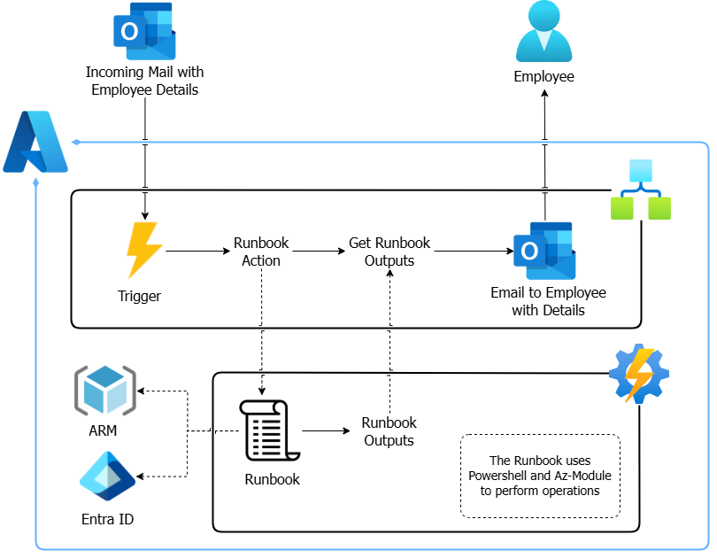

# Azure-Onboarding
An Azure Project for automating the process of setting up a user and resources for new employees via mails.

This is inspired by @madebygps list for AZ104, but I implemented it without using Logic app for whole functionality instead utilizing Automation Account due to incompatiblity I faced with Entra ID Connector.

# Flow

# Services/Tools Used
- Azure Logic App
- Azure Automation Accounts
- Azure Entra ID
- Azure Resource Manager
- Az Powershell Module
- Outlook

Check out [\docs](https://github.com/dotexe3301/Azure-Onboarding/tree/main/docs) for detailed steps.