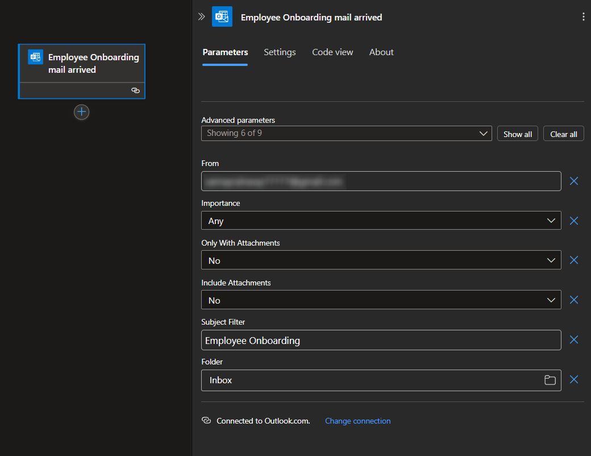
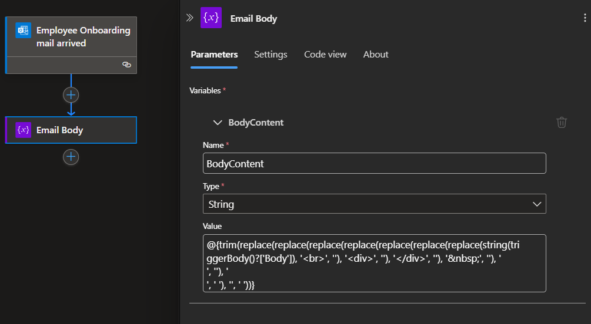
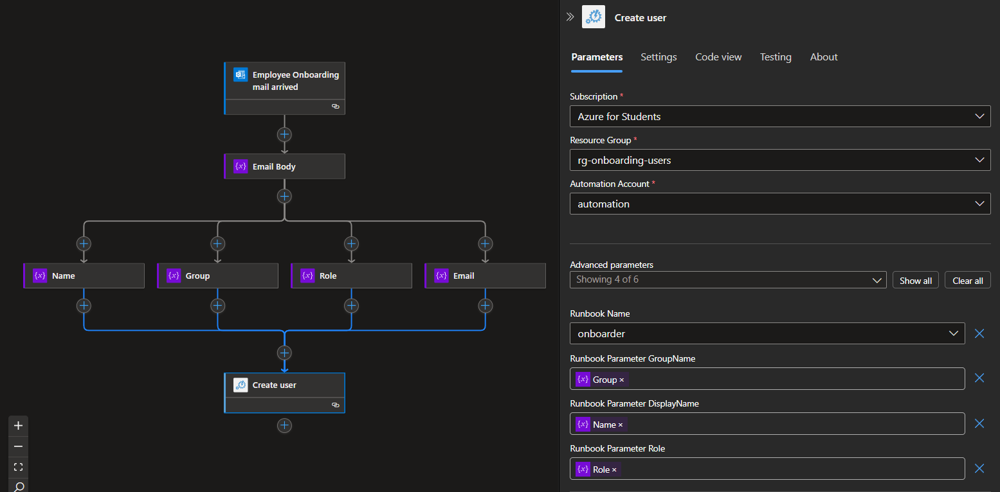
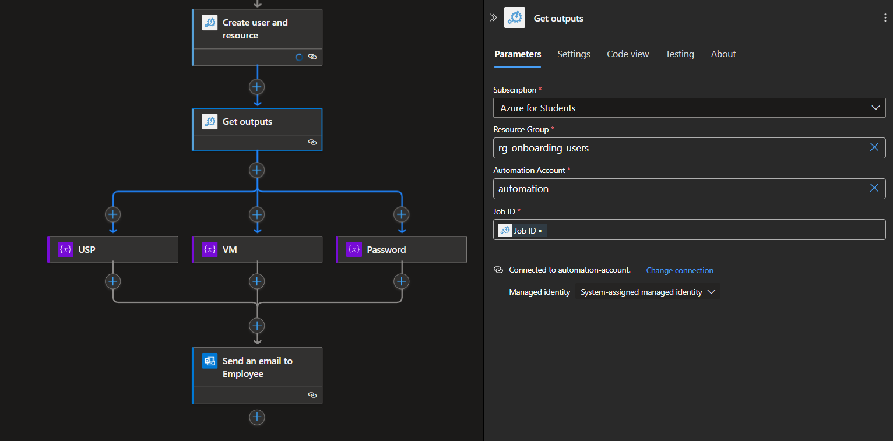
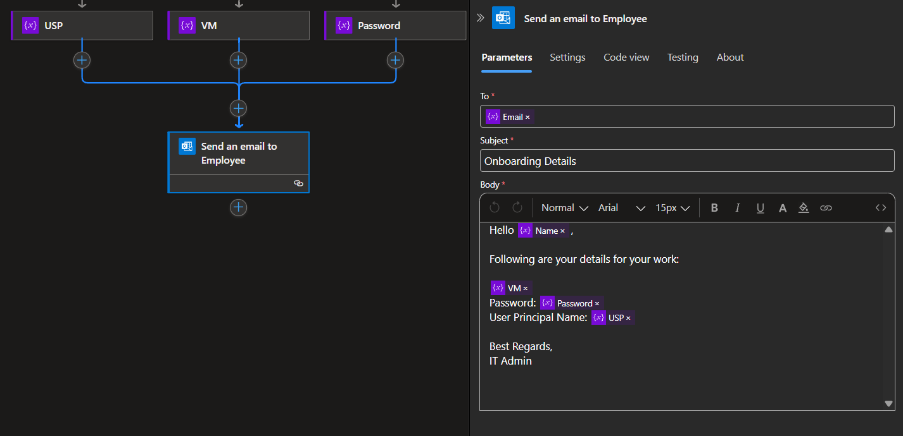
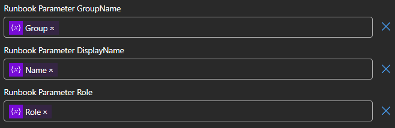
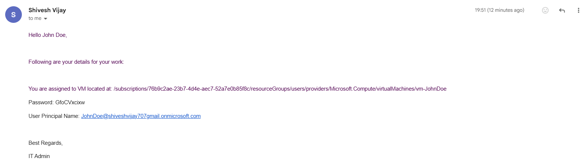

# 1.1 Some Pre-requisites
- Make an resource group named 'users' where all employee resources will be deployed.
- The code mentioned and related to this project is located in this [GitHub repository](https://github.com/dotexe3301/Azure-Onboarding).

# 1.2 Logic App Workflow
- The workflow will start from the Trigger when an email arrives in the mailbox:



- Get the body of the mail in the desired format so that we can work on it. For that, we will perform some string operations and store them in a variable:

`
trim(replace(replace(replace(replace(replace(replace(replace(string(triggerBody()?['Body']), '<br>', ''), '<div>', ''), '</div>', ''), '&nbsp;', ''), '\r\n', ''), '\n', ' '), '\r', ' '))
`



- Get Employee Details like Name, Group, Role, etc. from the above variable.
  - Name: `trim(split(split(variables('BodyContent'), 'Name: ')[1], 'Group:')[0])`
  - Group: `trim(split(split(variables('BodyContent'), 'Group: ')[1], 'Role:')[0])`
  - Role: `trim(split(split(variables('BodyContent'), 'Role: ')[1], 'Date:')[0])`
  - Email: `trim(split(split(split(split(variables('BodyContent'), 'Email: ')[1], 'Date:')[0], '>')[1], '<')[0])`
  - Password: You can make it in a runbook and use it like I did.

- Making a new job for an automation account runbook, and passing a variable to the PowerShell script:



- **Note:** For outputs to be fetched in next action, check the 'Wait for Job' option otherwise it won't read the outputs form the runbook.

- Now, to get Job output, choose the action and pass the dynamic value of JobId from previous action: 



- In the runbook, we defined a structure in JSON for output, to parse that correctly, initialize following variables:
  - USP: `trim(split(split(body('Get_outputs'), '\"UserName\": \"')[1], '\"')[0])`
  - VM: `trim(split(split(body('Get_outputs'), '\"VM\": \"')[1], '\"')[0])`
  - Password: `trim(split(split(body('Get_outputs'), '\"Password\": \"')[1], '\"')[0])`

- Pass these variables to the final action of Outlook Email:



# 1.3 Storage Account
- To make resources for new employees, we need an ARM Template.
- Make an json file with following code and put that file inside in a storage account container.
```json
{
  "$schema": "https://schema.management.azure.com/schemas/2019-04-01/deploymentTemplate.json#",
  "contentVersion": "1.0.0.0",
  "parameters": {
    "adminUsername": {
      "type": "string"
    },
    "location": {
      "type": "string"
    },
    "adminPassword": {
      "type": "string"
    },
    "vmName": {
      "type": "string"
    }
  },
  "variables": {
    "vNetName": "[concat(parameters('vmName'), '-vnet')]",
    "vNetAddressPrefixes": "10.0.0.0/16",
    "vNetSubnetName": "default",
    "vNetSubnetAddressPrefix": "10.0.0.0/24",
    "vmName": "[parameters('vmName')]",
    "publicIPAddressName": "[concat(parameters('vmName'), '-ip')]",
    "networkInterfaceName": "[concat(parameters('vmName'), '-nic')]",
    "networkSecurityGroupName": "[concat(parameters('vmName'), '-nsg')]"
  },
  "resources": [
    {
      "type": "Microsoft.Network/networkSecurityGroups",
      "apiVersion": "2020-05-01",
      "name": "[variables('networkSecurityGroupName')]",
      "location": "[parameters('location')]",
      "properties": {
        "securityRules": [
          {
            "name": "allow_ssh_rule",
            "properties": {
              "description": "Locks inbound down to ssh default port 22.",
              "protocol": "Tcp",
              "sourcePortRange": "*",
              "destinationPortRange": "22",
              "sourceAddressPrefix": "*",
              "destinationAddressPrefix": "*",
              "access": "Allow",
              "priority": 123,
              "direction": "Inbound"
            }
          }
        ]
      }
    },
    {
      "type": "Microsoft.Network/publicIPAddresses",
      "apiVersion": "2020-05-01",
      "name": "[variables('publicIPAddressName')]",
      "location": "[parameters('location')]",
      "properties": {
        "publicIPAllocationMethod": "Dynamic"
      },
      "sku": {
        "name": "Basic"
      }
    },
    {
      "type": "Microsoft.Network/virtualNetworks",
      "apiVersion": "2020-05-01",
      "name": "[variables('vNetName')]",
      "location": "[parameters('location')]",
      "dependsOn": [],
      "properties": {
        "addressSpace": {
          "addressPrefixes": [
            "[variables('vNetAddressPrefixes')]"
          ]
        },
        "subnets": [
          {
            "name": "[variables('vNetSubnetName')]",
            "properties": {
              "addressPrefix": "[variables('vNetSubnetAddressPrefix')]"
            }
          }
        ]
      }
    },
    {
      "type": "Microsoft.Network/networkInterfaces",
      "apiVersion": "2020-05-01",
      "name": "[variables('networkInterfaceName')]",
      "location": "[parameters('location')]",
      "dependsOn": [
        "[resourceId('Microsoft.Network/publicIPAddresses', variables('publicIPAddressName'))]",
        "[resourceId('Microsoft.Network/virtualNetworks', variables('vNetName'))]",
        "[resourceId('Microsoft.Network/networkSecurityGroups', variables('networkSecurityGroupName'))]"
      ],
      "properties": {
        "ipConfigurations": [
          {
            "name": "ipconfig1",
            "properties": {
              "privateIPAllocationMethod": "Dynamic",
              "publicIPAddress": {
                "id": "[resourceId('Microsoft.Network/publicIPAddresses', variables('publicIPAddressName'))]"
              },
              "subnet": {
                "id": "resourceId('Microsoft.Network/virtualNetworks/subnets', variables('vNetName'), variables('vNeSubnetName'))]"
              }
            }
          }
        ],
        "networkSecurityGroup": {
            "id": "[resourceId('Microsoft.Network/networkSecurityGroups', variables('networkSecurityGroupName'))]"
        }
      }
    },
    {
      "type": "Microsoft.Compute/virtualMachines",
      "apiVersion": "2021-11-01",
      "name": "[variables('vmName')]",
      "location": "[parameters('location')]",
      "dependsOn": [
        "[resourceId('Microsoft.Network/networkInterfaces', variables('networkInterfaceName'))]"
      ],
      "properties": {
        "hardwareProfile": {
          "vmSize": "Standard_B1s"
        },
        "osProfile": {
          "computerName": "[variables('vmName')]",
          "adminUsername": "[parameters('adminUsername')]",
          "adminPassword": "[parameters('adminPassword')]"
        },
        "storageProfile": {
          "imageReference": {
            "publisher": "Canonical",
            "offer": "0001-com-ubuntu-server-jammy",
            "sku": "22_04-lts-gen2",
            "version": "latest"
          },
          "osDisk": {
            "createOption": "fromImage"
          }
        },
        "networkProfile": {
          "networkInterfaces": [
            {
              "id": "[resourceId('Microsoft.Network/networkInterfaces', variables('networkInterfaceName'))]"
            }
          ]
        }
      }
    }
  ]
}
```

# 1.4 Automation Account
- Create an Automation account in the same resource group as the logic app; we will use this in the logic app connector to run the runbook.
- Create a runbook inside automation account with the following powershell code:

```ps
param(
    [string] $displayName,
    [string] $groupName,
    [string] $role
)
  
function Generate-Password {
    param(
        [int]$Length = 12,
        [string]$CharacterSet = "abcdefghijklmnopqrstuvwxyzABCDEFGHIJKLMNOPQRSTUVWXYZ0123456789!@#%"
    )
    $Password = ""
    for ($i = 0; $i -lt $Length; $i++) {
        $Password += $CharacterSet[(Get-Random -Maximum $CharacterSet.Length)]
    }
    return $Password
}
  
$password = Generate-Password -Length 10
$securePassword = ConvertTo-SecureString -String $password -AsPlainText -Force
$usp = (($displayName -split ' ') -join '') + "@YOUR-DOMAIN"
  
Write-Output "Creating User: $($displayName) in group: $($groupName) with role: $($role)."
  
# User Creation
Connect-AzAccount -Identity
$user = New-AzADUser -DisplayName $displayName -UserPrincipalName $usp -Password $securePassword -MailNickname (($displayName -split ' ') -join '')
$group = Get-AzADGroup -DisplayName $groupName
Add-AzADGroupMember -TargetGroupObjectId $group.Id -MemberObjectId $user.Id
  
# Resource Provisioning
$uri = "YOUR-BLOB-SAS-URL"
$vmName = "vm-" + (($displayName -split ' ') -join '')
$templateParams = @{
    vmName        = $vmName
    location      = "centralindia"
    adminUsername = (($displayName -split ' ') -join '')
    adminPassword = $password
}

New-AzResourceGroupDeployment -Name "EmployeeVMProvising" -ResourceGroupName "users" -TemplateUri $uri -TemplateParameterObject $templateParams 
New-AzRoleAssignment -ObjectId $user.Id -RoleDefinitionName "Virtual Machine Contributor" -Scope "/subscriptions/76b9c2ae-23b7-4d4e-aec7-52a7e0b85f8c/resourceGroups/users/providers/Microsoft.Compute/virtualMachines/$vmName"

# Outputs to Logic App
$output = @{
    UserName = $usp
    Password = $password
    VM = "You are assigned to VM located at: /subscriptions/SUBSCRIPTION-ID/resourceGroups/users/providers/Microsoft.Compute/virtualMachines/$vmName"
}
$output | ConvertTo-Json
```
- This runbook accepts the following parameters, which are passed from Logic App:


# 1.5 Notes
<ul style="color:red;font-weight:500">
<li> Make sure your managed identity associated with the Logic App has enough permissions on some scope to access the automation account.</li>
<li>Make sure your managed identity associated with the Automation Account have enough permissions on 'users' resource group for creating resource deployments, for creating users and managing them.</li>
</ul>

# 1.6 Demonstration
- The mail that triggers the workflow will have a body that follows the structure below:
```
Hello XYZ,
There is a new Employee joining our organization ABC. Please onboard the following new employee:

Name: John Doe
Group: IT
Role: IT Admin
Email: johdoe@gmail.com
Date: 24 April 2025
    
Best Regards,
HR
```
- The workflow will start running and at end will send details to the employee's email like below: 


